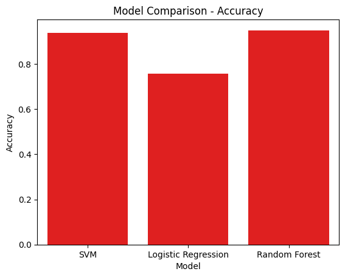
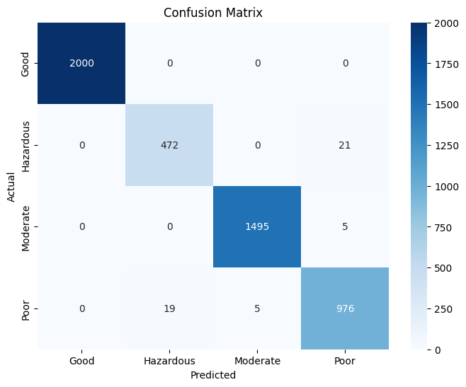

Read me 
# 🏭 Air Quality Classification Using Machine Learning

This project applies various machine learning models to classify air quality levels using real-world pollution data.

## 📌 Project Goals
- Load and explore air pollution data
- Preprocess data (encoding, scaling, balancing)
- Train and evaluate multiple classifiers
- Compare performance using accuracy and confusion matrix

## 🧪 Models Used
- Logistic Regression
- Support Vector Machine (SVM)
- Random Forest
- Gradient Boosting
- MLPClassifier (Neural Network)
- Stacking Classifier

## 📊 Evaluation Metrics
- Accuracy
- Classification Report
- Confusion Matrix

## 📁 Dataset
The dataset is named `updated_pollution_dataset.csv`, which includes features like:
- Temperature
- Humidity
- Wind
- Air Quality label (target)

## 🛠️ Libraries Used
- `pandas`, `scikit-learn`, `matplotlib`, `seaborn`
- `imblearn` (for NearMiss undersampling)

## 📷 Sample Output

### 🔹 Accuracy Comparison

### 🔹 Confusion Matrix

---

Feel free to explore or use parts of this code for your own ML workflows!

